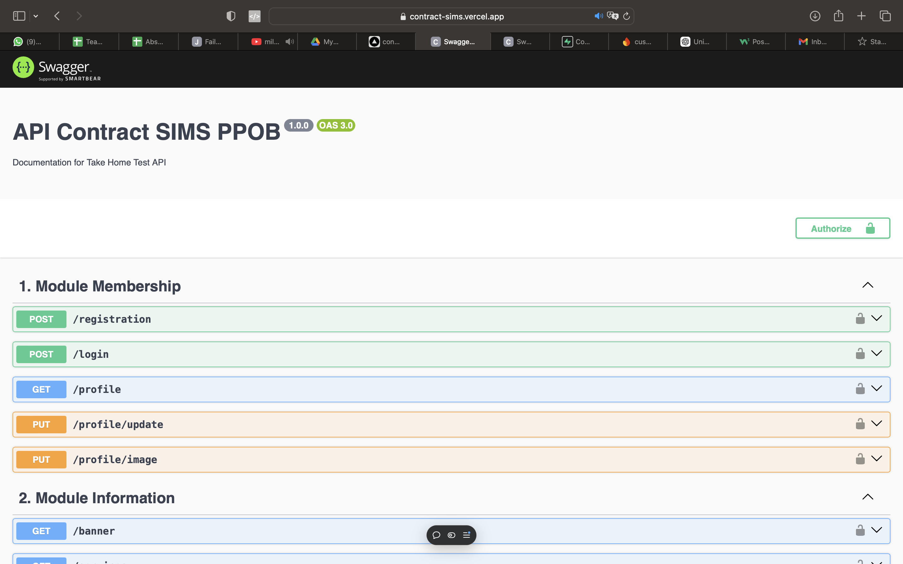
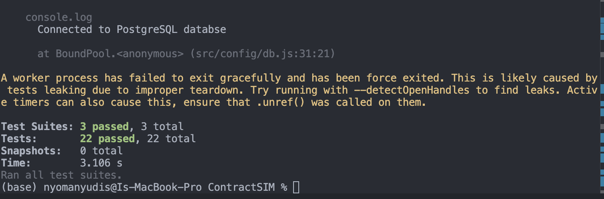

# API Contract SIMS PPOB

Adalah sebuah API yang secara garis besar untuk menghandle request untuk membuat membership, display information layanan, top up balance, and membuat transaksi. Project ini dibuat dengan tujuan untuk mengerjakan take home test. API ini hanya memiliki satu role yaitu member. API ini bisa di coba di [link](https://contract-sims.vercel.app/api-docs/). 

## Note Yang Perlu Diinfokan karena berbeda dengan contoh/ ketentuan
1. Jika saya melihat secara keseluruhan saya berasumsi bahwa di request login 'email' menjadi PRIMARY KEY (PK). Namun di project ini saya menjadikan seluruh table column id menjadi PK dan is_active. Tujuannya adalah agar di project ini tidak perlu menjalankan DELETE query, melainkan hanya perlu mengganti is_active = false. Hal ini bermanfaat agar record tidak hilang dan mencegah error jika mempunyai FOREGIN KEY(FK). Oleh karena itu saat request login, data yang ditambahkan dalam token jwt adalah membership id menggantikan email. Dan input service_code digantikan oleh service_id
2. Di request login, Saya tidak menambahkan validasi email dan password dikarenakan untuk fokus pada autentikasi, email sudah terverfikasi sebelumnya, fleksibilitas pengguna, dan pengalaman pengguna. Jadi di request ini hanya validasi apakah email dan password match dan terdaftar. 

## Status [Done]

### Method used 
- Express (Router)
- Middleware 
- Authentication
- Handle Request (GET, POST, PUT)
- Documentation 
- File Upload 
- Unit Test

### Technologies 
- Javascript 
- Node JS
- PostgreSQL 
- Swagger 
- JWT
- Vercel 
- Superbase 
- Firebase Storage
- Jest 
- Joi 
- supertest

## Get Started 
1. Silahkan persiapkan PC anda dengan enviroment Node JS dengan mengikuti instruksi di [link](https://nodejs.org/en) ini
2. Silahkan download project ini dengan cara download zip atau git clone 
3. tambahkan file .env dengan key yang terdiri dari 
    - PORT,ENV = untuk running proeject di port dan enviroment apa 
    - PG_HOST_DEV,PG_PORT_DEV,PG_USER_DEV,PG_PASSWORD_DEV,PG_DATABASE_DEV = untuk setting konfigurasi ke database postgresql 
    - GCP_TYPE,GCP_PROJECT_ID,GCP_PRIVATE_KEY_ID,GCP_PRIVATE_KEY,GCP_CLIENT_EMAIL,GCP_CLIENT_ID,GCP_AUTH_URI,GCP_TOKEN_URI,GCP_AUTH_PROVIDER,GCP_CERT_URL,GCP_UNIVERSE_DOMAIN,GCP_BUCKET_URL = untuk setting konfigurasi ke cloud storage firebase
    - JWT_SECRET_KEY = untuk secret key JWT Token saat login
4. run "npm install" di terminal untuk menginstall depedency node js 
5. run "npm run server" di terminal untuk menjalkan project ini di local
6. run "npm run test" di terminal jika ingin menjalankan unit test

## Tampilan Swagger 

## Tampilan Hasil Unit Test
